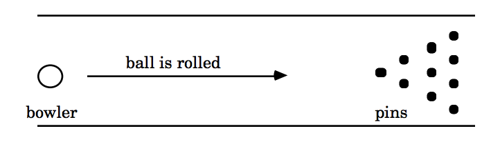
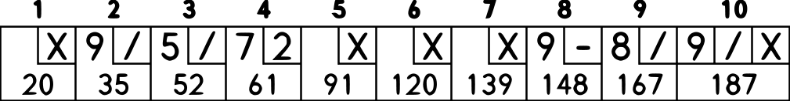

# Kata Bowling

## The problem

### American Ten-Pin Bowling

Create a program, which, given a valid sequence of rolls for one line of American Ten-Pin Bowling, produces the total score for the game. 

#### Brief description

Basically a bowling game consist to roll a ball down a bowling lane to knock down the pins at the end of the lane.



#### Scoring Rules

We can briefly summarize the scoring for this form of bowling:

Each game, or “line” of bowling, includes ten turns, or “frames” for the bowler.

Bowlers use a score sheet that’s organized to clearly display the score for each
frame and each ball. By convention, they use an X to represent a strike and a /
(slash) to represent a spare. Here’s how the game  would be scored:



- In each frame, the bowler can use **one or two shots** to knock down all the pins.

**Strike**
- If you knock down all 10 pins in the first shot of a frame, you get a strike.
- You won't roll the next ball in this frame.
- A strike is marked with '**X**' in the frame

How to score: A strike earns 10 points plus the sum of your next two shots. 

**Spare**

- If you knock down all 10 pins using both shots of a frame, you get a spare.
- An spare is marked with the number of pins knocked down in the first shoot and a '**/**' in the frame.

How to score: A spare earns 10 points plus the sum of your next one shot.

**Open Frame**
- If you do not knock down all 10 pins using both shots of your frame (9 or fewer pins knocked down), you have an open frame.
- Open frame is marked with the numbers of pins knocked down in the first and second shoot in the frame.

How to score: An open frame only earns the number of pins knocked down.

**Miss**
- If in one shoot you don't knock down any pin, it is a miss.
- An spare is marked with '**-**' in the frame

How to score: A miss not count


**The 10th Frame**

The 10th frame is a bit different:
- If you roll a strike in the first shot of the 10th frame, you get 2 more shots.
- If you roll a spare in the first two shots of the 10th frame, you get 1 more shot.
- If you leave the 10th frame open after two shots, the game is over and you do not get an additional shot.

How to Score: The score for the 10th frame is the total number of pins knocked down in the 10th frame.

More info on the rules at:
 
 - [How to Score for Bowling](https://www.topendsports.com/sport/tenpin/scoring.htm)
 - [Keeping_Score](https://www.bowl.com/Welcome/Welcome_Home/Keeping_Score/)
 - [Bowling score online calculator](http://www.bowlinggenius.com/)


### Problem input/output

(When scoring “X” indicates a strike, “/” indicates a spare, “-” indicates a miss)

- X X X X X X X X X XXX (12 rolls: 12 strikes) = 10 frames * 30 points = 300
- 9- 9- 9- 9- 9- 9- 9- 9- 9- 9- (20 rolls: 10 pairs of 9 and miss) = 10 frames * 9 points = 90
- 5/ 5/ 5/ 5/ 5/ 5/ 5/ 5/ 5/ 5/5 (21 rolls: 10 pairs of 5 and spare, with a final 5) = 10 frames * 15 points = 150

## The Solution

I tried through TDD to create a clean, immutable and functional solution with a rich domain.

The solution could be easier, from an input output perspective you could just parse the string and generate the expected score, 
but part of the problem was to create a good design exploring kotlin and its language features.

### Environment
```bash
java -version 
java version "1.8.0_131"
Java(TM) SE Runtime Environment (build 1.8.0_131-b11)
Java HotSpot(TM) 64-Bit Server VM (build 25.131-b11, mixed mode)
```
```bash
gradle -version   

------------------------------------------------------------
Gradle 4.0.1
------------------------------------------------------------

Build time:   2017-07-07 14:02:41 UTC
Revision:     38e5dc0f772daecca1d2681885d3d85414eb6826

Groovy:       2.4.11
Ant:          Apache Ant(TM) version 1.9.6 compiled on June 29 2015
JVM:          1.8.0_131 (Oracle Corporation 25.131-b11)
OS:           Mac OS X 10.13.3 x86_64
```
### Running the tests
```bash
gradle test 
```

### Build and run the app

It is a very simple command line runner for the app that expose the api:

```bash
gradle clean build
java -jar build/libs/bowling-1.0-SNAPSHOT.jar "X 3/ 6-1 X X X 2/ 9-0 7/ XXX"
193
```

### Approach

There is one single entry point for the application, it has the functionality of facade and it orchestrate the
two main parts of the implementation:

1. Parse from string to bowling game domain class structure
2. Call score algorithm to calculate the score from domain 


Entry point: (AmericanTenPinBowling.ex)

```kotlin
val bowlingGame = AmericanTenPinBowling()
bowlingGame score "X 3/ 6-1 X X X 2/ 9-0 7/ XXX"
```

#### Model

The model is pretty simple and represents a bowling game sheet.

A game is a list of frames and a final score (intermediate scores are out of the problem)
```kotlin
data class Game(val frames: List<Frame>, val total:Int? = null)
```

A frame is abstracted in a simple immutable data hierarchy
```kotlin
sealed class Frame 
data class OpenFrame(val pinsFirstRoll: Int, val pinsSecondRoll: Int) : Frame()
data class Spare(val pinsFirstRoll: Int) : Frame()
object Strike : Frame()
data class Tenth(val frame: Frame, val firstExtraBall: Int? = null, val secondExtraBall: Int? = null) : Frame()
```

#### Parsing

The parsing is just a pure function:
 ```
 (String) -> Game
 ```
 There is a default implementation provided by default made for the specifics of the problem input, but it can be
 override using dependency injection.
 The override should be done in the main class implementing an interface with a one method
 ```kotlin
  interface GameParser {
      fun parse(frames: String): Game
  }
  ```
 Implementing your own parser:
 ```kotlin
 val myCoolParser:GameParser = MyCoolParserImplementation
 val bowlingGame = AmericanTenPinBowling(myCoolParser)
 bowlingGame score "your_patterns"
 ```
   
#### Scoring algorithm

The score algorithm is also a pure function:
 ```
 Game -> Int
 ```

The algorithm is simple and recursive:

- Given a current frame and a accumulate score
- Call a score frame function with the current frame, the next and the next of the following if they exists
```
 (Frame, Frame?, Frame?) -> Int
 ```
- Accumulate the result
- Call recursively same method with the next frame to score

Remember: We will need to lookahead in the scoring for strike and spare. At the time we throw a strike or spare, 
we cannot calculate the frame score: we have to wait one or two frames to find out what the bonus is.

#### Out of scope / to improve

- Game and frame validator, now it has some validation but not complete.
- Extend the general api and expose the game
- Provide intermediate and total scores as part of the domain
- Better error handling

